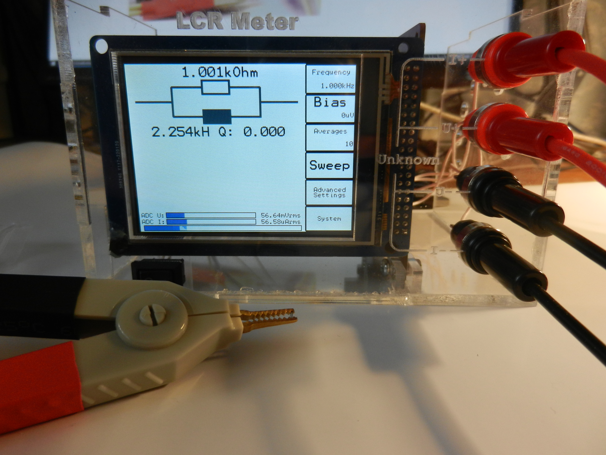

# LCR Meter

### Key specifications
* Measurement frequency: 100Hz-200kHz
* Usable impedance range: 20mOhm-1MOhm (measurements above and below this range are possible but due to very low ADC values, the reported phase will be quite noisy)
### Some useful features
* Optionally apply DC bias voltage up to 10V (measure effective capacitance of MLCCs)
* Autoranging
* Open/Short calibration (lead compensation)
* Fully configurable sweep, showing up to two parameters across frequency:
  * Impedance
  * Phase
  * Capacitance
  * Inductance
  * ESR
  * Quality factor
##### Example of a sweep, showing the self-resonant frequency of a capacitor at approximately 5.5kHz

#### Modified version:
* Two possible toolchains: System Workbench for STM32 or IAR
* Slightly modified PCB
* Laser-cut acrylic case
##### Resistance measurement 1 kOhm +- 0.1%

